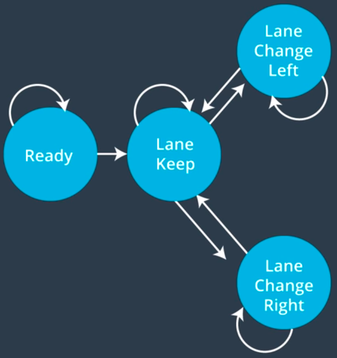

# Path Planning with Finite State Machines
This repository was created as a submission for the Path Planning project of Udacity's Self Driving Car Nanodegree. The goal of the Path Planning project was to create a path planner in C++ and test it against Udacity's simulator.


## Overview
The main objective of this project was to create a C++ program which communicates with a highway simulator, sending path coordinates to drive the car under a given speed, avoid collisions and make lane changes if necessary. The project was completed using finite state machines and cost functions as described below.


## Inputs

The inputs from the simulator to the path planner are the following:
- main car's localization data: position in map/Frenet coordinates, yaw angle, speed
- previous path data: list of previous points sent by the planner, with the processed points removed
- previous path's end s and d values (Frenet coordinates)
- sensor fusion data: a 2D vector of all other cars' attributes on the same side of the road (position, speed, ID)

## Outputs

The path planner's output to the simulator is a list of x-y coordinates for the vehicle to visit every 0.02 seconds.

## Implementation of the path planner

The path planner is implemented mainly in the ```Planner``` class (in ```planner.cpp```), which contains the most important functions:
- ```get_successor_states()```
- ```set_speed()```
- ```generate_trajectory()```,

as well as the cost functions used for the state transition function.

The state transition function (used for selecting the next state based on possible next states and their associated costs) is implemented in ```main.cpp``` (lines 106 - 128).

Additionally, the ```Vehicle``` class is used to store vehicle data, such as the current position, lane, speed, and state of the ego vehicle.

### Finite state machines

Implementation of the path planner relies heavily on the concept of finite state machines and a very simplified model of highway driving. In this model, the vehicle has 3 states:
- lane keeping
- changing lanes to the left
- changing lanes to the right



The objective of the path planner is to use cost functions to continuously select the optimal next state based on the ego vehicle's position and the sensor data of the surrounding vehicles.

### Cost functions

Cost functions are used to decide which state would be the best considering the fact that we would like to drive safe, but still as fast as possible. In this simplified model, 3 cost functions were used:

- lane change cost: very high if unsafe, otherwise small
- lane speed cost: the faster, the better
- vehicle count cost: the less, the merrier

## Running the code

The repo is configured to start up by running the default build task in VS Code if the simulator is installed in the same directory. It can also be manually run using the following commands from the project's top directory:

1. ```mkdir build && cd build```
2. ```cmake .. && make```
3. ```./path_planning```,

which will run the path planner. To download and run the simulator, see: [Udacity Simulator](https://github.com/udacity/self-driving-car-sim/releases/tag/T3_v1.2)


## Pass criteria for the project

The main requirement for this project was to be able to drive at least 4.32 miles without incident, meaning:
- the car drives according to the speed limit
- maximmum acceleration and jerk are not exceeded
- the car does not have collisions
- the car stays in its lane, except for the time between changing lanes

The car should also be able to smoothly change lanes when it makes sense to do so, such as when behind a slower moving car and an adjacent lane is clear of other traffic.

## Results and Summary

My path planner was able to keep lanes, follow vehicles and change lanes up to 50 miles without incident, which is far from safe in real life standards, but was sufficient for the purposes of this project and impressive considering the simplicity of the model.

There are many areas in which the path planner could be improved, including the following:
- Smoother lane changes
- Watching out for dangerous drivers (currently most incidents are caused by other vehicles aggresively changing lanes)
- Optimizing lane selection
- Watching all lanes instead of only adjacent ones
